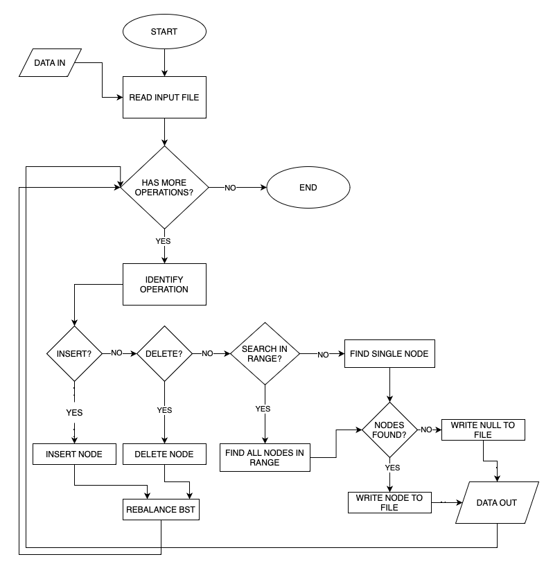
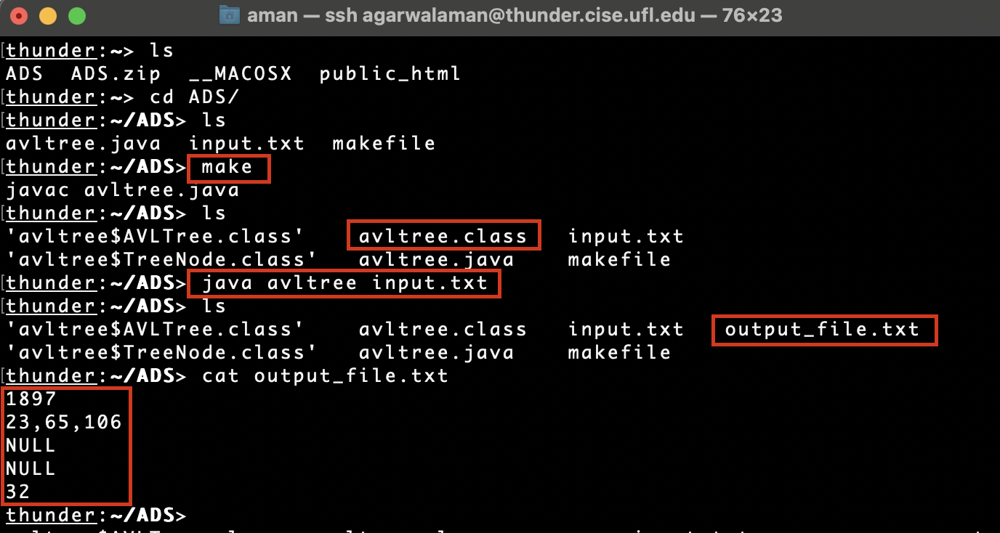

# Programming Assignment

### **Advanced Data Structures - Fall 2022**

**Name**: Aman Kumar Agarwal

**UFID**: 8349 4778

UF-Email: agarwalaman@ufl.edu

---

## Part 1: Running the code:

---

1. Unzip the folder Agarwal_Aman.zip
2. There will be three files namely:
    1. avltree.java: main java file containing the source code
    2. makefile: used to compile and generate class files
    3. input.txt: sample input text file (as given on canvas)
3. Run `make` command - This will generate three class files
    1. `avltree.class` :The main java class to run the program
    2. `avltree$AVLTree.class` :All the utilities for AVL tree is stored inside this class.
    3. `avltree$TreeNode.class`:  Each node’s structure is stored in this class.
4.  Run `java avltree <input_file_name>` where <input_file_name> is the command line parameter for the input file.
5. Result: An output file with the name `output_file.txt` will be generated.

## Part 2: Program Structure

---

Main Java Class: avltree has a AVLTree class which contains the main tree. The nodes inside the tree have the structure of `TreeNode`

### Structure of each node

```java
class avltree{

	public static class TreeNode {
	        int key;                // DATA FIELD
	        int height;             // EACH NODE'S HEIGHT
	        TreeNode left;          // LEFT CHILD
	        TreeNode right;         // RIGHT CHILD
	        TreeNode(int key){
	            this.key = key;
	        }
	        TreeNode(){}
	    }

	public static class AVLTree {..}  // Contains the main AVL tree
}
```

### Function prototypes

AVL Operations:

```java
// SETUP
static AVLTree Initialize(){..}                     // Initialize the main AVL tree

// ROTATIONS
TreeNode rotateRight(TreeNode toRotateNode) {..}    // right rotate a node
TreeNode rotateLeft(TreeNode toRotateNode) {..}     // left rotate a node
TreeNode doubleRLrotate(TreeNode toRotateNode){..}  // rotate right then rotate left
TreeNode doubleLRrotate(TreeNode toRotateNode){..}  // rotate left then rotate right

// BASIC OPERATIONS
TreeNode insert(TreeNode currNode, int key) {..}    // basic utility to insert in BST followed by rebalance
TreeNode delete(TreeNode node, int key) {..}        // delete a node
TreeNode searchSingleNode(int key) {..}             // search single node and return node value if present
void searchInRange(                                 // search in a range of values starting from low upto
	int low, int high,                                //  high (both inclusive). The arraylist res stores the
	TreeNode root,                                    //   result in the recursive function. 
	ArrayList<Integer> res){..}

// SELF BALANCING UTILITIES

void reAdjustHeight(TreeNode currNode) {..}         // readjust height whenever needed
int height(TreeNode currNode) {..}                  // utility to get each node's height
int getBalance(TreeNode currNode) {..}              // returns balance factor as right height - left height
TreeNode rebalance(TreeNode curNode) {..}           // readjust heights/rotate nodes after each operation
TreeNode minimumLeftChild(TreeNode node){..}        // find the smallest value in right subtree (for delete)

String helperUtility(ArrayList<Integer> result){..} // helper to format the output of search in range.
```

### Part 3: CodeFlow



### Part 4: Basic Function definitions:

| Operation | Definition |
| --- | --- |
| Rebalance | Rebalance the BST to maintain a balance factor between -1 and 1 for each node. |
| Insert | Insert as in a normal BST by either going left or right on the basis of key + Rebalance |
| Delete | Delete as in a normal BST + Rebalance |
| Single Rotate | Shift the nodes either up or down one level to bring back the balance factor between -1 and 1. |
| Double Rotate | Rotate two times (LR or RL) to normalise the balance factor as required in an AVL tree. |
| Search Single | Search for a single node in the AVL tree & write the node’s key to a file if found, else write NULL. |
| Search In Range | Search for all the nodes between a given range and write all the nodes to a file. If none, write NULL. |

### Part 5: Sample run output on CISE server



### Part 6: Complexity:

N: number of nodes in the tree.

| Operation | Time Complexity |
| --- | --- |
| Insert | O(logN) as the tree is balanced.  |
| Delete | O(logN) as the tree is balanced.  |
| Search | O(logN) as the tree is balanced.  |

---

---
